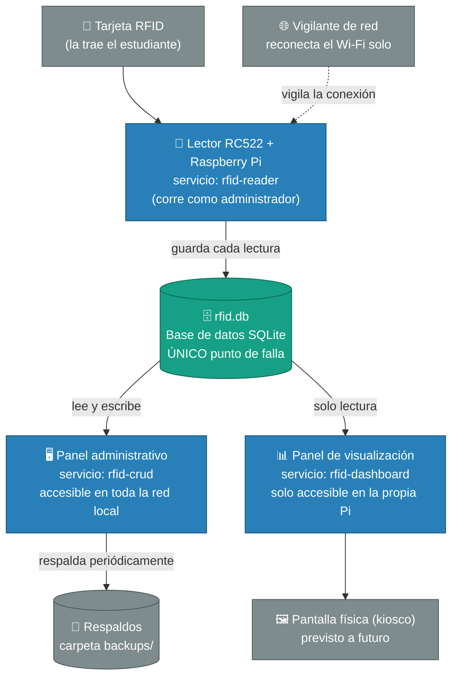
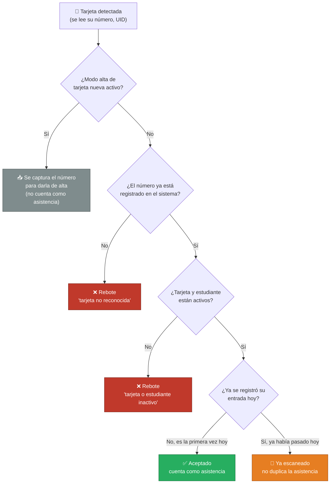
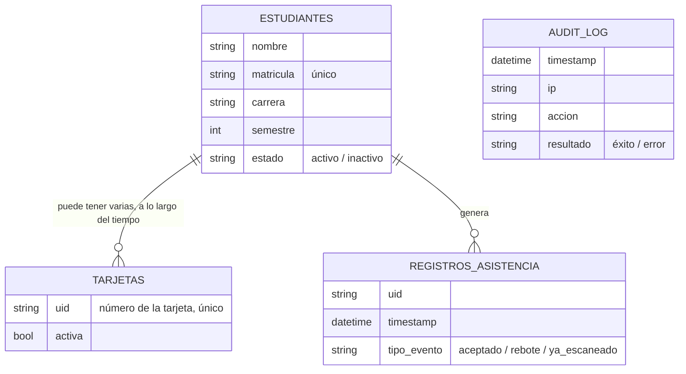
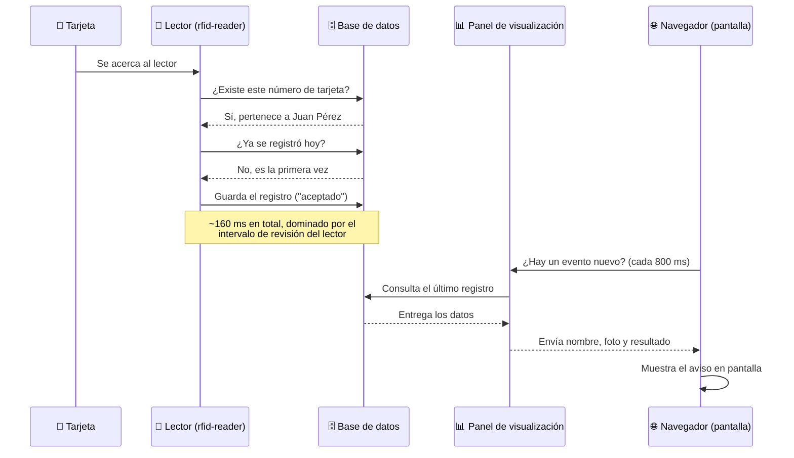

# 📇 Sistema de Control de Asistencia por RFID
### Guía completa del proyecto, explicada en lenguaje sencillo

**Instituto Tecnológico Superior del Occidente del Estado de Hidalgo (ITSOEH)**
**Ingeniería en Tecnologías de la Información y Comunicación**

---

> **Datos del proyecto**
>
> | Campo | Valor |
> |---|---|
> | **Estudiante** | Adrián Moreno Méndez |
> | **Matrícula** | 22011747 |
> | **Asesor** | José Martín Oropeza Méndez |
> | **Modalidad** | Servicio Social |
> | **Fecha del reporte original** | 18 de junio de 2026 (actualizado a agosto de 2026) |

---

## 📖 Acerca de este documento

Este README explica, de manera clara y sin tecnicismos innecesarios, cómo funciona el Sistema de Control de Asistencia por RFID desarrollado durante el Servicio Social en el ITSOEH. Su propósito es que cualquier persona —sin importar si tiene o no formación en informática— pueda entender qué hace el sistema, cómo está construido, qué tan seguro es y qué se recomienda mejorar a futuro.

El contenido conserva todos los datos técnicos reales del proyecto (nombres de archivos, tablas de la base de datos, tiempos de respuesta, hallazgos de seguridad, etc.), pero los explica con analogías y palabras cotidianas siempre que es posible. Cuando un término técnico es indispensable, se explica la primera vez que aparece y se incluye también en el glosario (sección 15). Los diagramas de este documento están hechos con Mermaid, un formato de texto que GitHub dibuja automáticamente como diagrama — no son imágenes sueltas, así que se mantienen legibles y editables junto con el resto del texto.

## 🗂️ Tabla de contenido

1. [Introducción y objetivos](#1-introducción-y-objetivos)
2. [Cómo está organizado el sistema, en conjunto](#2-cómo-está-organizado-el-sistema-en-conjunto)
3. [El hardware: las piezas físicas](#3-el-hardware-las-piezas-físicas-del-sistema)
4. [Qué hace el sistema cuando se acerca una tarjeta](#4-qué-hace-el-sistema-cada-vez-que-se-acerca-una-tarjeta)
5. [Cómo está organizado el software](#5-cómo-está-organizado-el-software)
6. [La base de datos](#6-la-base-de-datos-qué-información-se-guarda-y-cómo)
7. [El panel administrativo](#7-el-panel-administrativo-qué-se-puede-hacer-desde-ahí)
8. [El recorrido de un dato: de la tarjeta a la pantalla](#8-el-recorrido-completo-de-un-dato-de-la-tarjeta-a-la-pantalla)
9. [El panel de visualización en tiempo real](#9-el-panel-de-visualización-en-tiempo-real)
10. [Exportación de reportes y actualización del sistema](#10-exportación-de-reportes-y-actualización-del-sistema)
11. [Registros y bitácoras](#11-registros-y-bitácoras-del-sistema)
12. [Seguridad del sistema](#12-seguridad-del-sistema)
13. [¿Qué pasa si algo falla?](#13-qué-pasa-si-algo-falla)
14. [Conclusiones y recomendaciones](#14-conclusiones-y-recomendaciones)
15. [Glosario de términos](#15-glosario-de-términos)
16. [Referencias](#16-referencias)

---

## 1. Introducción y objetivos

### 1.1 ¿Por qué se hizo este proyecto?

Tomar la asistencia a mano —pasando lista o firmando en una hoja— es lento y da pie a errores: alguien puede firmar por otra persona, se pueden perder las hojas, o simplemente toma tiempo de clase que podría usarse para enseñar. Para resolver esto, como parte del Servicio Social se diseñó e implementó un sistema que registra la asistencia de forma automática: cada estudiante acerca una tarjeta a un lector, el sistema reconoce quién es y guarda el registro al instante, sin que nadie tenga que escribir nada a mano.

### 1.2 Objetivo general

Diseñar, construir y documentar un sistema de asistencia por RFID (identificación por radiofrecuencia, es decir, tarjetas que se leen sin contacto físico) que sea funcional, razonablemente seguro y fácil de mantener para el ITSOEH, de modo que sirva tanto para uso diario como para que otra persona pueda darle continuidad en el futuro.

### 1.3 Objetivos específicos

- Leer tarjetas RFID mediante un lector físico conectado a una computadora pequeña (una Raspberry Pi 4).
- Guardar de forma ordenada la información de los estudiantes, sus tarjetas y cada registro de asistencia.
- Construir un panel de administración desde el cual dar de alta y baja estudiantes y tarjetas, y exportar la información.
- Construir una pantalla de visualización en tiempo real con las cifras del día.
- Hacer que el sistema se recupere solo ante fallas comunes, como una desconexión de red, y que quede constancia de quién hizo qué dentro del panel de administración.
- Revisar la seguridad del sistema e identificar qué se podría mejorar.
- Dejar todo documentado, para que el conocimiento no se pierda cuando termine el Servicio Social.

### 1.4 ¿Qué tan grande es el sistema?

El sistema funciona de manera local, dentro de la propia red del plantel: no depende de internet ni de ningún servicio externo para operar. Está pensado para un solo punto de lectura (un lector de tarjetas) y, tal como está configurado hoy, se usa únicamente para la carrera de Ingeniería en Tecnologías de la Información y Comunicación.

---

## 2. Cómo está organizado el sistema, en conjunto

El sistema se compone de varias piezas que trabajan juntas, cada una con una responsabilidad clara. Pensarlo como una pequeña fábrica ayuda a entenderlo: una tarjeta llega a la "entrada" (el lector), la información se guarda en un "almacén central" (la base de datos) y, desde ahí, distintas "ventanillas" muestran o permiten modificar esa información.

*Diagrama 1. Visión general del sistema — cómo se conectan sus piezas.*

> **Punto importante:** como toda la información vive en un único archivo (la base de datos), ese archivo es el eslabón más delicado de todo el sistema. Si se dañara y no existiera un respaldo reciente, todo el sistema quedaría "a ciegas" al mismo tiempo. Esta idea se retoma con más detalle en la sección 13.

El panel administrativo (que escucha en el puerto de red 5001) sí es accesible desde otros equipos de la red local, mientras que el panel de visualización (puerto 5000) solo puede verse desde la propia Raspberry Pi —por ejemplo, en la pantalla física que eventualmente se conecte a ella—. Esta diferencia es intencional: reduce la cantidad de puntos desde los que alguien podría intentar acceder al sistema.

---

## 3. El hardware: las piezas físicas del sistema

El sistema utiliza componentes electrónicos sencillos y económicos, elegidos porque son suficientes para esta tarea y fáciles de conseguir y reemplazar.

### 3.1 Lista de materiales

| Componente | ¿Para qué sirve? | Cantidad |
|---|---|---|
| Raspberry Pi 4 Model B | Es la computadora que corre todo el sistema (el lector, el panel administrativo y el panel de visualización). | 1 |
| Lector RFID RC522 | Detecta las tarjetas cuando se acercan y lee su número de identificación. | 1 |
| Tarjetas o llaveros MIFARE | Es lo que cada estudiante presenta ante el lector. | Una por usuario |
| Tarjeta microSD (16 GB o más, clase 10) | Guarda el sistema operativo, la base de datos y los archivos de registro. | 1 |
| Fuente de alimentación oficial de 5 V / 3 A (USB-C) | Alimenta tanto a la Raspberry Pi como al lector. | 1 |
| Cables tipo Dupont (hembra-hembra) | Conectan el lector a la Raspberry Pi. | 7 |
| Gabinete ventilado con acceso al conector de pines | Protege el equipo y permite el cableado hacia el lector. | 1 |

*Tabla 1. Materiales utilizados para construir el sistema.*

### 3.2 Cómo se conecta el lector a la Raspberry Pi

El lector RC522 se conecta mediante un estándar de comunicación llamado SPI (un protocolo de datos rápido usado entre módulos electrónicos cercanos), usando siete cables. La tabla siguiente indica exactamente qué pin del lector va a qué pin de la Raspberry Pi, información útil tanto para el montaje inicial como para una reparación futura.

| Pin del lector RC522 | Función | Se conecta al pin físico de la Raspberry Pi |
|---|---|---|
| 3.3V | Alimentación (energía) | Pin 1 |
| RST | Reinicio del módulo | Pin 22 |
| GND | Tierra (referencia eléctrica común) | Pin 6 |
| IRQ | No se usa en este proyecto | Sin conectar |
| MISO | Envío de datos del lector hacia la Pi | Pin 21 |
| MOSI | Envío de datos de la Pi hacia el lector | Pin 19 |
| SCK | Señal de reloj (sincroniza la comunicación) | Pin 23 |
| SDA / SS | Selección del dispositivo | Pin 24 |

*Tabla 2. Conexión física entre el lector RC522 y la Raspberry Pi 4.*

> ⚠️ **Advertencia importante:** el lector trabaja con 3.3 voltios. Conectarlo por error a la salida de 5 voltios de la Raspberry Pi puede dañar de forma permanente tanto el lector como el propio equipo. El pin IRQ se deja sin usar a propósito, porque el programa revisa el lector cada 150 milisegundos por su cuenta, en lugar de esperar una señal del propio módulo.

### 3.3 Requisitos de energía

La Raspberry Pi necesita una fuente oficial de 5 voltios y 3 amperes; usar un cargador de celular genérico puede provocar caídas de voltaje que, en el peor de los casos, corrompan la base de datos si ocurren justo mientras se está guardando un registro. El lector consume muy poca energía (entre 13 y 30 miliamperes aproximadamente) y se alimenta directamente del propio riel de 3.3 voltios de la Raspberry Pi, por lo que no necesita una fuente aparte. En sitios donde el suministro eléctrico no sea confiable, se recomienda considerar un respaldo de energía pequeño (una batería tipo power bank, o UPS) para evitar cortes abruptos.

### 3.4 Cómo se monta físicamente

El montaje sigue un orden sencillo:

1. Se prepara la tarjeta microSD con el sistema operativo ya instalado.
2. Se fija la Raspberry Pi dentro del gabinete, dejando accesible el conector de pines.
3. Se cablea el lector siguiendo la Tabla 2, cuidando que cada cable quede bien insertado, ya que una conexión floja es la causa más común de lecturas fallidas.
4. El lector se coloca lejos de superficies metálicas (tornillos, chasis, la propia fuente de alimentación), porque el metal cercano reduce mucho su alcance de lectura.
5. Se orienta el lector hacia el punto donde la persona acercará su tarjeta, dejando un pequeño espacio libre frente a él.
6. Se aseguran los cables con cinta o una brida para que no se aflojen por el uso diario.
7. Se conecta la alimentación solo hasta el final, después de revisar que todo el cableado esté correcto.
8. Antes de cerrar el gabinete definitivamente, se comprueba que el sistema esté funcionando con una lectura de prueba.

---

## 4. Qué hace el sistema cada vez que se acerca una tarjeta

El programa que controla el lector revisa constantemente si hay una tarjeta cerca (cada 150 milisegundos, es decir, unas seis o siete veces por segundo). Cuando detecta una, sigue una serie de preguntas, en este orden, para decidir qué hacer con ella:

*Diagrama 2. Lógica de decisión del lector ante cada tarjeta.*

Para evitar que una sola pasada de tarjeta genere varios registros mientras la persona la retira del lector, el sistema ignora lecturas repetidas de la misma tarjeta durante dos segundos (a esto se le llama, en electrónica, "anti-rebote" o *debounce*). Además, si el lector deja de responder por más de ocho segundos —una falla de comunicación, no la simple ausencia de tarjetas—, el sistema lo reinicia automáticamente, sin intervención humana.

### 4.1 Por qué el sistema solo lee el número de la tarjeta

Las tarjetas que usa el sistema pueden guardar información en su interior protegida con una contraseña criptográfica, pero este proyecto no lee ni escribe esa información: únicamente lee el número de identificación de fábrica de la tarjeta (su "UID"), que se obtiene en un paso anterior a cualquier verificación de contraseña. Esto es suficiente y razonable para control de asistencia, donde el riesgo es bajo, pero conviene ser honestos sobre su límite: existen tarjetas regrabables capaces de imitar el número de otra tarjeta, así que la seguridad del sistema descansa en que la lista de tarjetas válidas esté bien controlada administrativamente, no en una propiedad criptográfica de la tarjeta misma. Si en algún momento el sistema se usara para proteger algo de mayor valor que el registro de asistencia, valdría la pena migrar a un tipo de tarjeta con autenticación más fuerte.

### 4.2 Qué pasa si no hay lector conectado

Si el programa se ejecuta en una computadora que no tiene el lector conectado (por ejemplo, durante pruebas o desarrollo), el sistema lo detecta automáticamente y simplemente se queda a la espera, sin fallar ni generar errores. Es importante aclarar que este modo no simula lecturas de tarjetas: solo evita que el programa se caiga por falta de hardware.

---

## 5. Cómo está organizado el software

El sistema está compuesto por tres programas principales, cada uno enfocado en una sola tarea, y dos programas de apoyo que corren en segundo plano. Separarlos así tiene una ventaja práctica: si uno falla, los demás pueden seguir funcionando (este punto se retoma en la sección 13).

| Programa | Qué hace | Quién puede usarlo |
|---|---|---|
| Lector de tarjetas | Vigila el lector físico, decide si un escaneo cuenta como asistencia y lo guarda en la base de datos. | Nadie directamente; corre solo, en segundo plano. |
| Panel administrativo | Página web para dar de alta y baja estudiantes y tarjetas, generar reportes, hacer respaldos y administrar el equipo. | Personal autorizado, con usuario y contraseña. |
| Panel de visualización (dashboard) | Pantalla de solo lectura con las cifras del día en tiempo real. | Cualquiera con acceso a la pantalla física o a la red local. |
| Vigilante de red | Revisa la conexión Wi-Fi y la restablece sola si se cae. | Nadie directamente; corre solo, en segundo plano. |
| Modo kiosco (previsto a futuro) | Abriría el panel de visualización a pantalla completa en un monitor dedicado. | No implementado aún; el acceso actual es vía navegador en la red local. |

*Tabla 3. Los cinco programas que componen el sistema y su función.*

### 5.1 Cómo se mantienen siempre encendidos

Cada uno de estos programas está registrado ante el propio sistema operativo (mediante un mecanismo llamado *systemd*) para que arranque automáticamente cuando se enciende la Raspberry Pi y, si llegara a cerrarse por cualquier motivo, se reinicie solo a los pocos segundos. El programa del lector corre con permisos de administrador porque necesita acceso directo al hardware; el panel administrativo y el panel de visualización, en cambio, corren con una cuenta de usuario normal, con permisos limitados, ya que no necesitan tocar el hardware directamente —solo la base de datos—.

El panel administrativo y el panel de visualización usan un servidor llamado Gunicorn, configurado con dos procesos y dos "hilos" de atención cada uno; esto le permite responder varias peticiones al mismo tiempo sin bloquear unas con otras. El panel administrativo tiene además un margen de espera más largo (dos minutos) para operaciones que pueden tardar, como generar un reporte grande o respaldar la base de datos, mientras que el panel de visualización, que solo hace consultas rápidas, usa el margen estándar.

---

## 6. La base de datos: qué información se guarda y cómo

Toda la información del sistema vive en un solo archivo, usando un motor de base de datos llamado SQLite, configurado en un modo (llamado WAL) que permite que varios programas lean la información al mismo tiempo sin bloquearse entre sí, mientras el lector sigue escribiendo nuevos registros de forma constante.

### 6.1 Qué información guarda cada tabla

*Diagrama 3. Relación entre la información que guarda el sistema. La bitácora de auditoría (`AUDIT_LOG`) es independiente: no está ligada a estudiantes ni tarjetas.*

| Tabla | Qué guarda | Dato más importante |
|---|---|---|
| Estudiantes | Nombre, matrícula, carrera, semestre, grupo, correo, foto y si está activo o inactivo. | La matrícula debe ser única para cada estudiante. |
| Tarjetas | El número de cada tarjeta física y a qué estudiante pertenece (si ya fue asignada). | Un mismo estudiante puede tener varias tarjetas a lo largo del tiempo (por ejemplo, si repone una extraviada). |
| Registros de asistencia | Cada evento de lectura: quién, cuándo y si fue aceptado, rechazado o ya se había registrado ese día. | Es la tabla que más crece; nunca se borra automáticamente. |
| Bitácora de auditoría | Qué acciones administrativas sensibles se realizaron (reinicios, restauraciones, bajas masivas), desde qué dirección de red y si tuvieron éxito. | Sirve para reconstruir qué pasó ante cualquier duda o incidente. |

*Tabla 4. Las cuatro tablas que componen la base de datos del sistema.*

### 6.2 Por qué borrar un estudiante no borra su historial

Cuando se elimina un estudiante de la base de datos, sus tarjetas y su historial de asistencia no desaparecen con él: quedan como registros "huérfanos", identificables por el número de tarjeta, en lugar de borrarse en cascada. Esta decisión fue deliberada, por dos razones. Primero, el historial de asistencia documenta hechos que ya ocurrieron —una tarjeta pasó por el lector en tal fecha y hora— y borrarlo automáticamente eliminaría evidencia que podría necesitarse después, por ejemplo para una auditoría o un trámite administrativo. Segundo, si un estudiante se elimina por error de captura, conservar sus registros permite reconciliar la información manualmente; si se hubieran borrado en cascada, esa información se habría perdido de forma irreversible en el mismo instante. Por este motivo, el sistema prefiere "dar de baja" a un estudiante (marcarlo como inactivo, sin borrarlo) en lugar de eliminarlo físicamente; la eliminación física queda reservada para casos excepcionales, como un registro duplicado por error de captura.

### 6.3 Mantenimiento: respaldos, restauración y crecimiento

El panel administrativo permite generar un respaldo de la base de datos con un solo botón, en cualquier momento; ese respaldo usa el propio mecanismo de SQLite para garantizar que la copia quede completa y consistente, incluso si en ese momento se está escribiendo un nuevo registro. Restaurar un respaldo es una operación delicada —sobrescribe la información en uso— por lo que primero se detienen los programas que usan la base de datos, se guarda una copia de seguridad del estado actual por si acaso, y solo entonces se sustituye el archivo por el respaldo elegido.

Con un uso típico —entre 300 y 500 estudiantes activos y unos 2 a 4 escaneos por estudiante al día, incluyendo reintentos— la base de datos crece aproximadamente entre 150 y 300 kilobytes por día, lo que equivale a entre 13 y 27 megabytes por semestre y entre 30 y 60 megabytes por año. Incluso después de varios años de uso continuo sin depurar nada, el archivo se mantendría en el orden de unos pocos cientos de megabytes, muy por debajo de cualquier límite práctico. El verdadero riesgo a largo plazo no es el espacio en disco, sino que las consultas se vuelvan un poco más lentas conforme la tabla de registros crece a cientos de miles de renglones a lo largo de varios años; por eso se recomienda, al cierre de cada ciclo escolar, mover los registros más antiguos a un archivo histórico separado, conservando la posibilidad de consultarlos después si hiciera falta.

---

## 7. El panel administrativo: qué se puede hacer desde ahí

El panel administrativo es una página web que se comunica con el sistema mediante más de cincuenta funciones internas (en informática, a este conjunto de funciones se le llama una API). No es necesario conocer cada una de ellas para entender el sistema; basta con saber qué grandes tareas cubre y cómo está protegido.

### 7.1 Cómo se protege el acceso

Cada vez que alguien intenta usar el panel administrativo, el sistema exige un usuario y una contraseña (un esquema llamado "autenticación básica"); no existe una sesión que se quede abierta ni un botón de "cerrar sesión", cada solicitud debe presentar las credenciales. Estas credenciales no se comparan de la forma más simple posible, sino con una técnica resistente a los llamados "ataques de tiempo": una comparación ingenua puede, en teoría, delatar sin querer cuántos caracteres de la contraseña se acertaron según cuánto tarda en responder el sistema; la técnica usada aquí tarda siempre lo mismo, sin importar si la contraseña es correcta o no, cerrando esa posible fuga de información.

Además de la contraseña, el sistema tiene varias capas adicionales de protección: un límite de intentos fallidos por minuto (para frenar intentos de adivinar la contraseña por fuerza bruta), un mecanismo —ya construido pero actualmente apagado— para aceptar conexiones solo desde direcciones de red conocidas de la institución, encabezados de seguridad que dificultan ciertos ataques comunes en la web, un límite de tamaño máximo por solicitud (5 megabytes) y una protección adicional en las operaciones más delicadas (como reiniciar el equipo o borrar información en bloque), que exige una confirmación explícita antes de ejecutarse.

### 7.2 Qué se puede hacer desde el panel

| Área | Qué permite hacer |
|---|---|
| Estadísticas y análisis | Ver cifras del día y de los últimos siete días, así como comparativas por semestre y por hora. |
| Estudiantes | Dar de alta, editar, dar de baja o eliminar estudiantes, de forma individual o en bloque (por ejemplo, promover a todo un grupo de semestre, o dar de baja a una generación completa). |
| Tarjetas | Asignar, activar, desactivar o eliminar tarjetas, y asociarlas a un estudiante. |
| Alta rápida de tarjetas | Activar un modo de "escucha" para capturar el número de una tarjeta nueva con solo acercarla al lector, en lugar de teclearlo a mano; también admite capturar varias tarjetas seguidas en una sola sesión, útil al inicio de cada semestre. |
| Reportes y exportación | Descargar en formato CSV (compatible con Excel) el padrón completo de estudiantes o la asistencia de un día específico. |
| Hardware y red | Consultar temperatura, uso de memoria y espacio en disco del equipo, ver el estado de la conexión Wi-Fi, y reiniciar o apagar la Raspberry Pi de forma remota. |
| Base de datos | Ver su estado, crear y descargar respaldos, restaurar un respaldo anterior, y depurar registros antiguos según fecha, carrera, semestre o grupo (con una vista previa antes de borrar nada). |
| Bitácora de auditoría | Consultar el historial de acciones administrativas sensibles realizadas en el sistema. |

*Tabla 5. Principales funciones disponibles desde el panel administrativo.*

Una particularidad digna de mención: cuando algo falla dentro de una operación de depuración de registros ("purga"), el sistema garantiza que nunca se borre información sin haber logrado antes crear un respaldo de seguridad automático; si el respaldo no puede crearse, la operación completa se cancela.

### 7.3 Formato de las respuestas

Casi todas las funciones del panel devuelven la información en un formato estándar y homogéneo, de manera que un error inesperado en cualquiera de ellas se reporta siempre de forma consistente. Existen, sin embargo, cuatro funciones (la página principal del panel y las de exportación y descarga de archivos) que no siguen este mismo formato de error por la naturaleza de lo que entregan —un archivo en lugar de un mensaje corto—, algo a tener en cuenta si en el futuro se integra este panel con otro sistema.

---

## 8. El recorrido completo de un dato: de la tarjeta a la pantalla

Para entender qué tan rápido responde el sistema, conviene seguir paso a paso lo que ocurre desde que alguien acerca su tarjeta hasta que ese evento aparece reflejado en la pantalla de visualización.

*Diagrama 4. Secuencia completa desde que se acerca la tarjeta hasta que aparece en pantalla.*

| Etapa | Tiempo típico | Peor caso |
|---|---|---|
| Detección de la tarjeta por el lector | 0–75 ms | 150 ms |
| Consulta a la base de datos y guardado del registro | 3–11 ms | 30–65 ms |
| La pantalla detecta el evento nuevo | 0–800 ms | 800 ms |
| **Total, desde que se acerca la tarjeta hasta que aparece en pantalla** | **~250–350 ms** | **hasta ~1.1 s** |

*Tabla 6. Tiempos aproximados de respuesta del sistema, de la tarjeta a la pantalla.*

Vale la pena señalar con honestidad los puntos donde el sistema podría ser más eficiente. El más notable es que, para saber si el programa lector sigue activo, el panel de visualización le pregunta directamente al sistema operativo cada cinco segundos, y esa consulta en particular es bastante más lenta (entre 50 y 300 milisegundos) que cualquiera de las consultas a la base de datos; espaciarla un poco más —revisarla cada 30 o 60 segundos en lugar de en cada actualización— aliviaría esa carga sin perder utilidad real. Otro punto de mejora es que hoy no existe una forma de que la base de datos "avise" al panel de visualización en el instante en que ocurre un evento nuevo: todo funciona por consultas repetidas a intervalos fijos, lo cual es sencillo y confiable, pero impone ese límite de hasta 800 milisegundos antes de que un evento se refleje en pantalla.

---

## 9. El panel de visualización en tiempo real

Esta pantalla, pensada para mostrarse en un monitor dedicado o consultarse desde cualquier equipo de la red local, resume lo que ha ocurrido durante el día: cuántos accesos fueron aceptados, cuántos fueron rechazados, cuántas tarjetas están activas en el sistema, un listado de los eventos más recientes con el nombre de cada persona, y una gráfica de barras que muestra en qué horas del día hay más movimiento.

La actualización de esta pantalla ocurre en dos velocidades distintas, cada una ajustada a lo que realmente necesita. Cada 800 milisegundos, el sistema revisa si hubo un evento nuevo (una consulta muy ligera), y si lo hay, muestra de inmediato un aviso a pantalla completa con el nombre de la persona. Cada cinco segundos, se actualizan las cifras generales —los contadores, la gráfica por hora y el indicador de si el lector sigue activo—, ya que estos datos no cambian de un instante a otro y no tiene sentido recalcularlos con tanta frecuencia como el aviso de "tarjeta aceptada".

El diseño visual del panel está centralizado: todos los colores del panel están definidos en un solo lugar del código, así que cambiar, por ejemplo, el tono de azul institucional actualiza automáticamente el resto de los elementos que lo usan, sin tener que modificar cada uno por separado. De la misma forma, ya existe internamente una cifra —cuántas personas han vuelto a pasar su tarjeta después de su primer registro del día— que el sistema calcula pero que actualmente no se muestra en ningún lugar de la pantalla; añadirla es un buen ejemplo de mejora sencilla, ya que el dato ya viaja hasta el navegador, solo falta mostrarlo.

---

## 10. Exportación de reportes y actualización del sistema

El sistema no cuenta con un proceso automático que transforme datos entre distintos sistemas (lo que en informática se conoce como un proceso ETL); toda la información se guarda y se consulta directamente en la misma base de datos. Las dos únicas formas de "salida" de información hacia afuera del sistema son la exportación a reportes en formato CSV y las actualizaciones incrementales de la estructura de la base de datos, descritas a continuación.

### 10.1 Reportes en CSV

El panel administrativo permite descargar tanto el padrón completo de estudiantes como la asistencia de un día concreto, en un formato de texto separado por comas (CSV) que Excel puede abrir directamente. El sistema entrega estos archivos poco a poco, en pequeños bloques, en lugar de construir el archivo completo en memoria antes de enviarlo; esto evita que una exportación grande consuma de golpe toda la memoria disponible en la Raspberry Pi. Se incluyen además dos cuidados poco visibles pero importantes: el archivo indica explícitamente que su codificación es UTF-8 para que Excel muestre correctamente los acentos y la letra "ñ" sin configuración adicional, y cualquier campo de texto que comience con un carácter que Excel podría interpretar como el inicio de una fórmula (por ejemplo, un signo igual) se neutraliza automáticamente anteponiéndole una comilla, evitando así que un nombre mal intencionado se ejecute como una fórmula al abrir el archivo.

### 10.2 Cómo evoluciona la estructura de la base de datos

Cuando ha sido necesario agregar información nueva a la base de datos —por ejemplo, cuando se añadió la bitácora de auditoría—, esto se hizo mediante actualizaciones incrementales que se pueden ejecutar de forma segura las veces que hagan falta, sin borrar la información ya existente ni afectar a una instalación que ya tenía esos cambios aplicados. Este mecanismo está protegido detrás de un interruptor que permanece apagado en el uso normal del sistema, y que solo se activa temporalmente, de forma manual, en el momento en que se necesita aplicar una actualización, respaldando siempre la base de datos antes de hacerlo.

---

## 11. Registros y bitácoras del sistema

Además de la información de asistencia, el sistema guarda distintos tipos de registros técnicos que sirven para dar seguimiento y diagnosticar problemas.

| Fuente | Qué contiene | Cuánto tiempo se conserva |
|---|---|---|
| Registro del lector | Cada lectura de tarjeta, aceptada o no, con fecha y hora. | Aproximadamente un mes (últimas cuatro semanas). |
| Registro del vigilante de red | Intentos de reconexión Wi-Fi. | Aproximadamente un mes. |
| Bitácora de auditoría | Acciones administrativas sensibles: quién, qué, desde dónde y si tuvo éxito. | Indefinido; no se depura automáticamente todavía. |
| Registros del propio sistema operativo | Actividad general de cada uno de los cinco programas del sistema. | Gestionado por el sistema operativo, generalmente limitado por espacio en disco. |

*Tabla 7. Fuentes de registro del sistema y su política de conservación.*

La bitácora de auditoría merece una mención aparte, porque es la que documenta acciones con posible impacto real: reinicios o apagados del equipo, creación o restauración de respaldos, eliminación de un respaldo, depuraciones de registros antiguos, y promociones o bajas masivas de estudiantes. Cada una de estas acciones queda registrada con la fecha, la dirección de red desde donde se hizo, el detalle de la operación y si tuvo éxito o no —incluso los intentos de acceso bloqueados por exceso de intentos fallidos quedan anotados—. Para ser transparentes sobre sus límites: hoy no quedan registradas ahí las altas, ediciones o bajas individuales de un solo estudiante o tarjeta, ni el encendido y apagado de los programas de forma individual (solo el reinicio o apagado de todo el equipo); esta es una diferencia intencional entre "lo que se audita" (acciones de alto impacto) y "lo que ocurre en el día a día" (operaciones rutinarias).

---

## 12. Seguridad del sistema

Se realizó una revisión de seguridad enfocada en dos riesgos principales: que alguien pudiera ejecutar comandos no autorizados en el equipo (aprovechando que el panel puede reiniciar servicios del sistema de forma remota), y que alguien sin autorización pudiera acceder a la información o a las funciones administrativas del sistema.

### 12.1 Qué se encontró

| Hallazgo | Situación |
|---|---|
| Posible ejecución de comandos no autorizados | ✅ Descartado: el sistema solo acepta nombres de servicio de una lista predefinida y cerrada, y sanea cualquier valor antes de usarlo. |
| Endpoints sin autenticación | ✅ Descartado: la exigencia de usuario y contraseña cubre absolutamente todas las funciones del panel, sin excepción. |
| Las credenciales viajan sin cifrar por la red | 🔴 Pendiente. Es el hallazgo de mayor prioridad: se recomienda cifrar la conexión (HTTPS) antes de operar el sistema sin supervisión directa. |
| Contraseña de administrador poco robusta | 🟠 Pendiente. Se recomienda sustituirla por una generada de forma aleatoria y no reutilizada en ningún otro sistema. |
| Restricción por red institucional, construida pero apagada | 🟡 Pendiente activar. El mecanismo ya existe en el código; solo falta configurarlo y encenderlo. |
| Falta una confirmación explícita al reiniciar la conexión de red | 🟢 Pendiente, de baja prioridad. Otras operaciones similares sí piden confirmación; esta debería seguir el mismo criterio. |
| Contraseña débil en el mecanismo de respaldo por SSH | ⚪ Solo aplica si llegara a usarse ese modo alterno de conexión remota; no está en uso en la operación normal. |

*Tabla 8. Hallazgos de la revisión de seguridad y su estado actual.*

### 12.2 Buenas prácticas que ya están implementadas

- Comparación de contraseñas resistente a ataques que intentan medir el tiempo de respuesta.
- Límite de intentos fallidos de acceso, para frenar intentos de adivinar la contraseña.
- Registro automático en la bitácora de auditoría cuando una dirección de red queda bloqueada por exceso de intentos.
- Encabezados de seguridad en las respuestas del panel, que dificultan ataques comunes en páginas web.
- Todas las consultas a la base de datos usan parámetros seguros, nunca texto del usuario pegado directamente en la consulta —lo que previene el ataque conocido como inyección SQL.
- Validación estricta del nombre de archivo al restaurar un respaldo, que impide intentar acceder a archivos fuera de la carpeta permitida.
- Mecanismo de restricción por red institucional ya construido, listo para activarse.

### 12.3 Recomendaciones, en orden de prioridad

| Prioridad | Recomendación | Qué logra |
|---|---|---|
| 🔴 Alta | Colocar un intermediario con cifrado (HTTPS) delante del panel administrativo. | Evita que las credenciales viajen legibles por la red. |
| 🟠 Media | Cambiar la contraseña de administrador por una generada aleatoriamente. | Reduce el riesgo de que alguien la adivine o la reutilice de otro sistema. |
| 🟠 Media | Activar la restricción de acceso por red institucional. | Limita quién puede siquiera intentar entrar al panel, según su ubicación en la red. |
| 🟢 Baja | Exigir una confirmación explícita antes de reiniciar la conexión de red. | Evita reinicios accidentales de la conectividad. |

*Tabla 9. Recomendaciones de seguridad, priorizadas.*

---

## 13. ¿Qué pasa si algo falla?

Ninguna de las piezas del sistema es completamente independiente de las demás; sin embargo, están organizadas de tal forma que una falla parcial no necesariamente detiene todo el sistema.

*Diagrama 5. Qué tan grave es la falla de cada componente — rojo: crítico, naranja: no crítico para la operación diaria, gris: afecta solo lo cosmético o el acceso remoto.*

| Si esto falla… | …esto es lo que pasa | Qué tan grave es |
|---|---|---|
| La base de datos se daña | Todo el sistema queda ciego: nada puede leerse ni escribirse, en ninguna de sus partes. | 🔴 Crítico — es el único punto que, si falla, afecta a todo a la vez. |
| El programa del lector se detiene | Deja de registrarse asistencia nueva, aunque el resto del sistema sigue funcionando con la información ya existente. Se reinicia solo, generalmente en segundos. | 🔴 Crítico para el registro diario. |
| El panel administrativo se detiene | Se pierde la posibilidad de administrar el sistema, pero el lector sigue registrando asistencia con normalidad. | 🟠 No crítico para la operación diaria. |
| El panel de visualización se detiene | Se pierde la pantalla en tiempo real, pero los datos se siguen guardando sin problema y aparecerán en cuanto el panel se recupere. | 🟠 No crítico. |
| El vigilante de red se detiene | El Wi-Fi deja de repararse solo si se cae, pero mientras la conexión actual siga viva, no hay impacto inmediato. | 🟢 Afecta solo el acceso remoto. |

*Tabla 10. Qué ocurre si cada componente del sistema falla, y qué tan grave es.*

Esto deja claro por qué la base de datos es, con diferencia, el punto más delicado del sistema: hoy no existe una copia "en caliente" que pueda tomar su lugar automáticamente si falla, solo respaldos que se generan bajo demanda. Hay tres caminos posibles para reducir este riesgo, de menor a mayor esfuerzo:

1. **Respaldos automáticos frecuentes** (por ejemplo, cada dos horas en horario escolar) — no requiere ningún cambio al sistema y reduce drásticamente cuánta información se podría perder en el peor de los casos. Es la opción que se recomienda aplicar de inmediato.
2. **Copia periódica hacia otro equipo de la red** — una segunda red de seguridad fuera de la propia tarjeta de memoria de la Raspberry Pi.
3. **Migrar a un motor de base de datos con replicación automática** — ofrecería continuidad real ante una falla, pero implicaría reescribir buena parte del sistema y añadir la dependencia de un segundo equipo. Dado el tamaño actual del proyecto, este esfuerzo no se justifica todavía, y solo tendría sentido si el sistema creciera para cubrir varias carreras o varios lectores a la vez.

Ante una falla real, el procedimiento es restaurar el respaldo más reciente confiable, verificando primero que ese respaldo esté íntegro antes de ponerlo en producción. En el escenario extremo de no contar con ningún respaldo utilizable, es posible reconstruir la estructura de la base de datos desde cero, aunque en ese caso el historial completo de asistencia se pierde de forma irrecuperable —es evidencia que solo existía en ese archivo—; el padrón de estudiantes, en cambio, podría reconstruirse a partir de un reporte CSV exportado previamente. Este escenario extremo es, precisamente, la razón por la que vale la pena automatizar los respaldos aunque sea con el método más simple posible.

---

## 14. Conclusiones y recomendaciones

El sistema cumple con el objetivo que se planteó desde el inicio: automatizar el registro de asistencia mediante tarjetas RFID de forma confiable, con una arquitectura sencilla, autosuficiente (no depende de internet ni de servicios externos) y con buenas prácticas de seguridad ya presentes desde su construcción, como la autenticación obligatoria en todas las funciones y las consultas seguras a la base de datos. El hecho de que el lector, el panel administrativo y el panel de visualización sean programas independientes entre sí permite que una falla parcial no derribe todo el sistema, salvo por la dependencia que los tres comparten: una única base de datos.

| Prioridad | Recomendación para trabajo futuro |
|---|---|
| 🔴 Alta | Cifrar el tráfico del panel administrativo (HTTPS) antes de operar sin supervisión constante. |
| 🔴 Alta | Cambiar la contraseña de administrador por una robusta y exclusiva de este sistema. |
| 🟠 Media | Activar la restricción de acceso por red institucional, ya construida en el código. |
| 🟠 Media | Dar al vigilante de red un nombre más consistente con el resto de los servicios, para facilitar futuras auditorías. |
| 🟢 Baja | Ampliar el panel de visualización con análisis histórico (por semana, mes o semestre). |
| 🟢 Baja | Evaluar, si el caso de uso lo llegara a requerir, un tipo de tarjeta con autenticación criptográfica más fuerte. |
| 🟢 Baja | Automatizar los respaldos de la base de datos con una tarea programada, en lugar de solo bajo demanda. |

*Tabla 11. Recomendaciones para la continuidad del proyecto.*

---

## 15. Glosario de términos

| Término | Qué significa |
|---|---|
| RFID | Identificación por radiofrecuencia: tecnología que permite leer una tarjeta sin necesidad de contacto físico. |
| UID | El número de identificación único que trae cada tarjeta de fábrica. |
| SPI | El tipo de conexión por cable que usan el lector y la Raspberry Pi para comunicarse entre sí. |
| Base de datos | El archivo donde se guarda de forma organizada toda la información del sistema. |
| WAL | Un modo de funcionamiento de la base de datos que permite que varios programas la lean al mismo tiempo sin bloquearse. |
| API | El conjunto de funciones internas mediante las cuales el panel administrativo se comunica con el sistema. |
| Panel administrativo | La página web protegida donde el personal autorizado administra el sistema. |
| Dashboard (panel de visualización) | La pantalla de solo lectura con las cifras del día en tiempo real. |
| Debounce (anti-rebote) | Técnica para ignorar lecturas repetidas de una misma tarjeta en un intervalo muy corto de tiempo. |
| Autenticación básica | El esquema de usuario y contraseña que exige el panel administrativo en cada solicitud. |
| Punto único de falla (SPOF) | Un componente cuya falla detiene todo el sistema; en este proyecto, es la base de datos. |
| Bitácora de auditoría | El registro de quién hizo qué acción administrativa sensible, cuándo y con qué resultado. |

*Tabla 12. Glosario de términos técnicos usados en este documento.*

---

## 16. Referencias

Este documento se elaboró revisando directamente el código fuente del sistema; si el código cambia en el futuro (nuevas funciones, cambios en el comportamiento), este documento debería actualizarse para no quedar desincronizado con la realidad del proyecto. Para profundizar en los componentes de terceros que el sistema utiliza, se sugieren las siguientes fuentes oficiales:

- SQLite — documentación oficial del modo WAL: [sqlite.org/wal.html](https://www.sqlite.org/wal.html)
- Flask — documentación oficial del framework web utilizado: [flask.palletsprojects.com](https://flask.palletsprojects.com/)
- Gunicorn — documentación oficial del servidor usado para ejecutar el panel administrativo y el panel de visualización: [gunicorn.org](https://gunicorn.org/)
- Hoja de datos técnica del módulo lector MFRC522, publicada por su fabricante, NXP.
- systemd — documentación oficial de la gestión de servicios en Linux: [freedesktop.org/software/systemd/man/systemd.service.html](https://www.freedesktop.org/software/systemd/man/systemd.service.html)

### Anexo A — Esquema completo de la base de datos

La estructura completa de las tablas e índices de la base de datos —incluyendo cada columna con su tipo de dato— se encuentra en el archivo de inicialización del proyecto (`init_db.py`), disponible en el repositorio del sistema.

### Anexo B — Créditos

Documento elaborado como parte del Servicio Social en el Instituto Tecnológico Superior del Occidente del Estado de Hidalgo (ITSOEH), por **Adrián Moreno Méndez**, estudiante de Ingeniería en Tecnologías de la Información y Comunicación, bajo la asesoría de **José Martín Oropeza Méndez**.

---

**ITSOEH — Ingeniería en Tecnologías de la Información y Comunicación**
*Servicio Social · Sistema de Control de Asistencia RFID*

